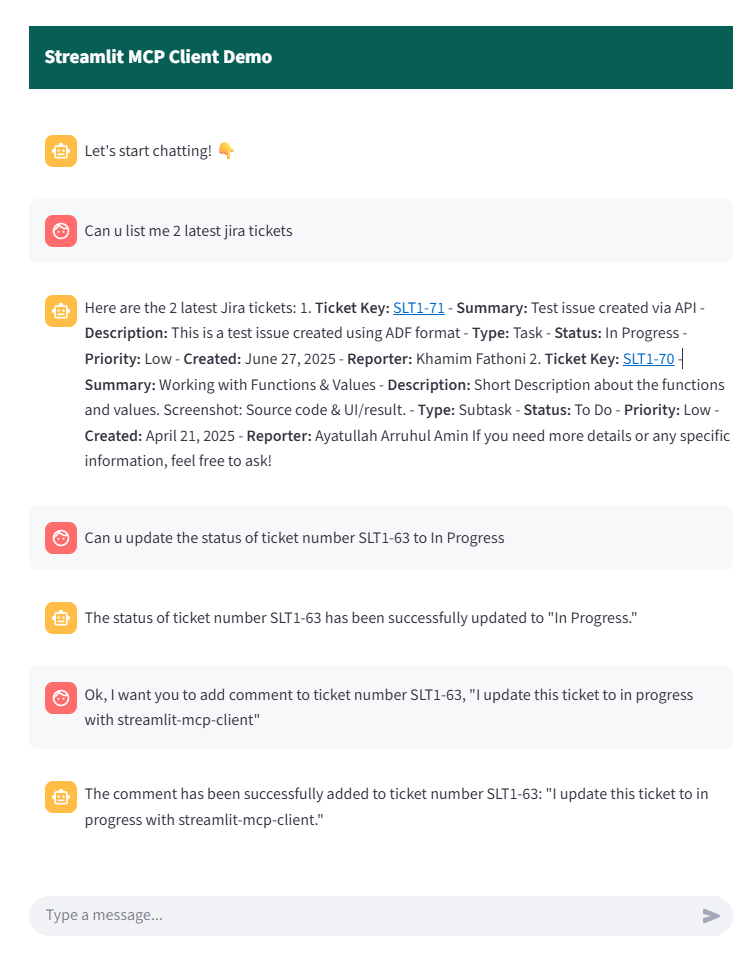

# 📦 MCP Project

This project consists of two subprojects:

- **`jira-mcp-server`** – FastMCP-based backend service
- **`streamlit-mcp-client`** – Streamlit-based frontend client

## 🗂️ Project Structure

```
.
├── jira-mcp-server/        # Backend API (FastAPI)
│   ├── src/
│   └── requirements.txt
├── streamlit-mcp-client/   # Frontend UI (Streamlit)
│   ├── src/
│   └── requirements.txt
└── .vscode/                # VS Code configurations (launch.json)
```

## 🚀 Getting Started

Each subproject uses its own isolated Python environment. Use [`uv`](https://github.com/astral-sh/uv) for environment management and dependency installation.

> **Note:** Make sure [`uv`](https://github.com/astral-sh/uv) is installed (`pip install uv`), or install dependencies manually via `venv` and `pip`.

## 🧠 Prerequisites

- Python 3.10+
- [uv](https://github.com/astral-sh/uv) (`pip install uv`) – or use `python -m venv` and `pip` instead
- VS Code (optional, `.vscode/launch.json` included)

## ⚙️ Setup and Run

### 🔧 1. Backend – `jira-mcp-server`

```bash
cd jira-mcp-server
uv venv  # Create virtual environment
source .venv/bin/activate  # On Windows: .venv\Scripts\activate
uv pip install -r requirements.txt
python src/main.py
```

### 🖥️ 2. Frontend – `streamlit-mcp-client`

```bash
cd streamlit-mcp-client
uv venv
source .venv/bin/activate  # On Windows: .venv\Scripts\activate
uv pip install -r requirements.txt
streamlit run src/main.py
```

## 💻 VS Code Integration

If you're using **VS Code**, a pre-configured `.vscode/launch.json` is included. Once Python and the environment are installed:

- Open the folder in VS Code
- Press `F5` or go to **Run > Start Debugging**
- Select the appropriate launch config (server or client)

## 📸 Screenshot

Below is a preview of how we create a prompt in the chat UI to send requests to the MCP server:



## 📄 License

MIT License

Copyright (c) 2025 Khamim Slash

Permission is hereby granted, free of charge, to any person obtaining a copy
of this software and associated documentation files (the "Software"), to deal
in the Software without restriction, including without limitation the rights  
to use, copy, modify, merge, publish, distribute, sublicense, and/or sell      
copies of the Software, and to permit persons to whom the Software is         
furnished to do so, subject to the following conditions:                       

The above copyright notice and this permission notice shall be included in     
all copies or substantial portions of the Software.                            

THE SOFTWARE IS PROVIDED "AS IS", WITHOUT WARRANTY OF ANY KIND, EXPRESS OR    
IMPLIED, INCLUDING BUT NOT LIMITED TO THE WARRANTIES OF MERCHANTABILITY,      
FITNESS FOR A PARTICULAR PURPOSE AND NONINFRINGEMENT. IN NO EVENT SHALL THE    
AUTHORS OR COPYRIGHT HOLDERS BE LIABLE FOR ANY CLAIM, DAMAGES OR OTHER        
LIABILITY, WHETHER IN AN ACTION OF CONTRACT, TORT OR OTHERWISE, ARISING FROM, 
OUT OF OR IN CONNECTION WITH THE SOFTWARE OR THE USE OR OTHER DEALINGS IN     
THE SOFTWARE.
